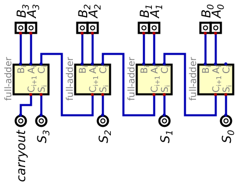
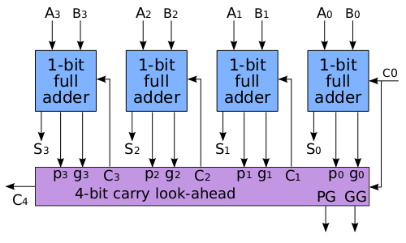

# Lab 5 - Adders 

## Introduction

This lab will explore how designs can start from a naive
approach based on how humans compute and then exloring the limiations of this naive 
approach and optimizing the design to make it faster. In this case we will look at a 
ripple-carry adder vs. the carry look ahead adder. You will only implement the ripple-carry adder
and are given the implementation of the carry look ahead adder. For a more detailed explanation 
you can look in any computer architecture text book or read [this](https://en.wikipedia.org/wiki/Adder_(electronics)) 
wikipedia article.

The ripple-carry adder, in theory, is quite simple and similar to how humans add multi-digit numbers,
in base 10. You start by adding the lowest order digit, and if a carry occurs,
you send that value to the next highest order digit column. Then procede until the highest non-zero digit 
is reached. While in a circuit everything is done in parallel, the actual result from the lowest 
order bit takes some time, know as **propagation delay**, to settle on the actual result before 
sending the actual carry value to the next digit. The next digit cannot settle on its final result until
it receive the final result from the previous digit, and so on. This behavior is what is referred 
to as a ripple affect, and why this type of approach his called a ripple-carry adder.

The figure below shows the basic circuit of a 4-bit ripple-carry adder. Notice the design is just 
the repetition of a single module, the full-adder, with the carry out of the lower order binary 
digit, or bit, connected to the carry in of the higher order bit. The carry in to the lowest order
full adder is hard coded to 0, and the carry out of the highest order bit is the carry out of the
entire adder (this can be used, for example, to determine overflow in an ALU).

The figure below shows the basic circuit of a 4-bit carry look ahead adder. Notice the design is uses
the half adder module, rather than a full adder. While this diagram uses full adders, it is also
possiblre to use half adders are connected to the carry look ahead logic. The implmentation we use
will use half adders. Refer to the chapter from Prof. Vahid's book. As with the ripple carry 
adder, the carry in to the lowest orderfull adder is hard coded to 0, and the carry out of the highest
order bit is the carry out of the entire adder (this can be used, for example, to determine overflow in an ALU).

As a quick primer on how the carry look ahead adder works, the following high level discription of how this logic works is given by the following formulas:

To determine if a bit pair will generate a carry we use the formula:

$G_i = A_i \cdot B_i$

To determin if a bit pair will propagate a carry we use the formula:

$P_i = A_i \oplus B_i$ or $P_i = A_i + B_i$

For a 4-bit adder all the carries can therefore be calculated with the following formulas:

$C_1 = G_0 + P_0 \cdot C_0$

$C_2 = G_1 + P_1 \cdot C_1$

$C_3 = G_2 + P_2 \cdot C_2$

$C_4 = G_3 + P_3 \cdot C_3$

If we substitute $C_0$ in to $C_1$ then subsitute that in to $C_2$, and so on, we get that each carrie is:

$C_1 = G_0 + P_0 \cdot C_0$

$C_2 = G_1 + G_0 \cdot P_1 + C_0 \cdot P_0 \cdot P_1$

$C_3 = G_2 + G_1 \cdot P_2 + G_0 \cdot P_1 \cdot P_2 + C_0 \cdot P_0 \cdot P_1 \cdot P_2$

$C_4 = G_3 + G_2 \cdot P_3 + G_1 \cdot P_1 \cdot P_2 + G_0 \cdot P_1 \cdot P_2 \cdot P_3 + C_0 \cdot P_0 \cdot P_1 \cdot P_2 \cdot P_3$

## Prelab

For the prelab you will modify test-bench file only. Furthermore, you only need to test the ripple
carry adder. You will work with the carry look ahead adder as part of the actual lab.

You should write this prelab before 
writing code for the actual ripple-carry adder. When the tests run against your empty 
implementation, all the tests should fail. This approach is called test driven development and is 
widely used in the software industry as well. Therefore, the expectation is, that when you turn
in the prelab to Gradescope all the tests will fail. Your grade for the prelab
will be based on the Verilog properly synthesizing (compiling by iverilog) and the completeness of 
your test cases. 

This lab should only require 7 or 8 test cases. Around 4 or 5 should test the correctness of the 
addition, and 2 or 3 tests to explore how the propogation delay increases as the number of bits 
increases. We'll call the first group of tests "Addition Behavior Verification" and the second
group "Increasing Number of Bits". You will see these groups in the template test-bench given
as part of this lab GitHub repository in [ripple_carry_adder_tb.v](./ripple_carry_adder_tb.v).

The first group of tests should only test that the addition functionality works as it should for
a fixed number of bits, lets start at 8-bits. You want test basic results, such as 0 + 0 = 0, A + B
actually equals A+B, and then also test the boundaries where carry out should occur, such as 255 + 1 
(for unsigned, or 127+1 for signed, but with no carryout). Then add a couple of random values (you 
don't need to generate random number, just come up with random values for the operands), just to be sure.

For the second group of tests we're going to use the `parameters` keyword to reuse the ripple carry
adder module with an increasing number of bits. Since the previous group tested 8-bits, we know 
already everything works for this number of bits. So start this group with 16-bits. You will need
to instantiate each size you want to test at the top of the test-bench module. The point is to 
create increasing larger adders, doubling the number of bits each time, run a simple test until in the given time, 
approximately 100 time units in the simulation, the adder test fails. In other words, there was not
enough time for all the bits to ripple through the adder in the given time to settle on the correct
result. For the prelab, try to guess how many bits will cause this failure by instantiating up to
the size you think will fail. _Hint_: it won't take many instances.

You will submit the entire lab repository to Gradescope. Part of your score will come from the fact
that it properly sythesizes. The other part of your score will be based on the completeness of your
tests, which the TA and I will grade.

## Deliverables

For this lab your are expected to build a Ripple Carry Adder that is parameterized to allow for any
number of bits to be added, though mostly the sizes will be powers of 2 greater than or equal to 8.
It should take two N-bit values, where N is the number of bits supported by the adder. These two 
inputs, `A` and `B`, are the operands for the addition operator. The output will be the N-bit `result` of
adding A and B, and a `carryout`, which indicates what the carry out of the highest order bit of the
addition operation. The only file you need to write code in, other than the test-bench, is 
[ripple_carry_adder.v](./ripple_carry_adder.v). Do not modify any of the other files. 

Next, you will instantiate an instance of the carry look ahead adder in [carry_look_aheader_adder.v](./carry_look_ahead_adder.v).
This instance will be tested, along side the ripple carry adder to show the difference in performance. You only
need to create and use this instance for the 2nd set of tests, where we look at the time needed to computer -1 + 1.
You should create an 8-bit, 16-bit, 32-bit and 64-bit instances.

For each ripple and carry look ahead instance of the same bit width will be run in parallel. In other words you will 
pass the values -1, and 1 to the both 8-bit adders, then both 16-bit adders, and so on. You will produce a wave form that
will show the difference in performance between the two adder algorithms.

### Ripple-Carry Adder Specification

- The module name **must** be named `ripple_carry_adder` (it's arleady named that in [ripple_carry_adder.v](./ripple_carry_adder.v))
- The module **must** use a parameter called "`NUMBITS`", specifying the bit width of the operands and result
- The module **must** have input/output ports with the **EXACT** names listed below

|Inputs   |Size |Outputs   |Size |
|---------|-----|----------|-----|
|`A`      |N-bit|`result`  |N-bit|
|`B`      |N-bit|`carryout`|1-bit|
|`carryin`|1-bit|          |     |

We'll discuss later what the `carryin` input is. For now, you can assume it will be zero.

#### Carryout

The `carryout` output of the Ripple Carry Adder is the same as the carryout for the most significant
bit of the circuit. This output can be used to indicate overflow, for example when adding xFF and 
01.

### Writing the Test-Bench

You should have already written the test-bench for the prelab for this lab and all future labs. 
However, it's common to make changes before turning in based on actually building the module. 
Therefore changes to the test-bench are normal and have no impact on your grade. Gradescope will 
use it's own set of test cases for grading this lab, but should be similar to your final
test-bench.

### Producing the Waveform

Once you've synthesized the code for the test-bench and the Ripple Carry Adder module, you can run
the test-bench simulation script to make sure all the tests pass. This simluation run should
produce the code to make a waveform. Use techniques you learned in the previous lab to produce a
waveform for this lab and save it as a PNG. You will use this waveform in the lab write up and you
should look at it to see the actual ripple.

You don't need to add a marker this time. Also, I've provided a .gtkw file to help you see this 
ripple in the waveform

### The Lab Report

Finally, create a file called REPORT.md and use GitHub markdown to write your lab report. This lab
report will again be short, and comprised of two sections. The first section is a description of 
each test case. Use this section to discuss what changes you made in your tests from the prelab
until this final report. Also describe if your prediction about the how many bits would cause 
failing tests was correct. The second section should include your waveform and discuss how this 
waveform shows the ripple that causes the delay. You should be able to see these ripples in the 
waveform, so this section describes where you found it.

## Submission:

Each student **​must**​ turn in their repository from GitHub to Gradescope. The contents of which should be:
- A REPORT.md file with your name and email address, and the content described above
- All Verilog file(s) used in this lab (implementation and test benches).

**If your file does not synthesize or simulate properly, you will receive a 0 on the lab.**
