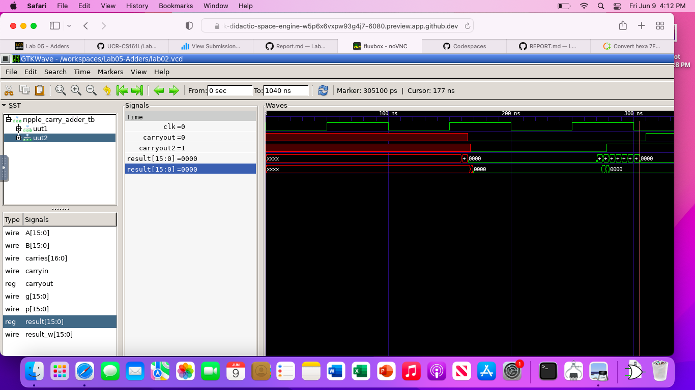
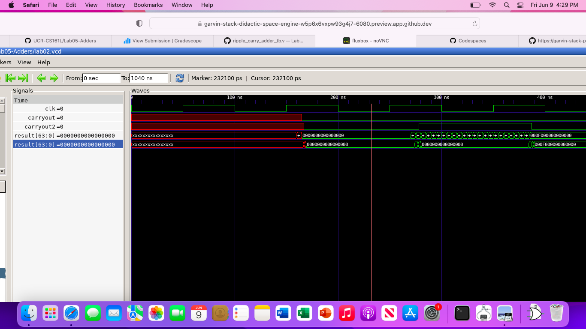

For the test cases we are doing 0 + 0, -127 + 1, 0 + 15, 127 + 1
These cases are used to test the edges of addition, so zero addition, negative and positive addition, and just positive addition.

ripple carryout adder = 34800 ps
carry look ahead adder = 6800 ps

ripple carryout adder = 35500 ps
carry look ahead adder = 5600 ps

ripple carryout adder = 115100 ps
carry look ahead adder = 5600 ps

The ripple carry adder takes significantly more time than carry look ahead adder.
